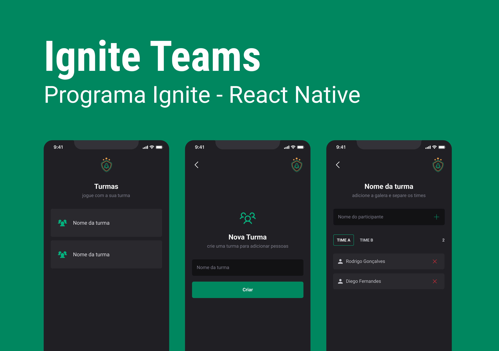

  

## ⚠️ In progress

---

## 🔖 Layout

You can view the project layout through the links below:

- [Layout](<https://www.figma.com/design/dnIXKXnqopDNB2Jexk9w47/Ignite-Teams-(Community)?m=auto&is-community-duplicate=1&fuid=1465861890338750270>)

Remembering that you need to have a [Figma](http://figma.com/) account to access it.

 

---

Developed by [ricardorhv](https://github.com/ricardorhv) 🖤